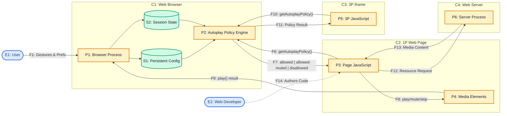

# Review

You can find the presentation for this review [here](https://realarcherl.github.io/W3C-presentations/autoplay_policy_detection.html)
because this caught my attention: https://github.com/w3c/breakouts-day-2026/issues/15

1. Link to the Spec: https://www.w3.org/TR/autoplay-detection/
2. Security Review Request: https://github.com/w3c/security-request/issues/48
3. [Self-Review Questionnaire](https://www.w3.org/TR/security-privacy-questionnaire/): https://github.com/w3c/autoplay/blob/main/security-privacy-questionnaire.md

# Security Review
1. Threat Modeling Guide: https://w3c.github.io/threat-modeling-guide/
2. Security & Privacy Questionnaire: https://www.w3.org/TR/security-privacy-questionnaire/
3. PING's (Privacy Interest Group) review: https://w3c.github.io/ping/summaries/PING-minutes-20230216.html#3-privacy-review-of-autoplay-policy-detection

# Threat Model
_Note_: _Claude Opus 4.6 was used when building this threat model._

## What is the Spec about?
> The Autoplay Policy Detection spec “provides web developers the ability to detect if automatically starting the playback of a media file is allowed in different situations.

> Most user agents have their own mechanisms to block autoplaying media, and those mechanisms are implementation-specific. Web developers need to have a way to detect if autoplaying media is allowed or not in order to make actions, such as selecting alternate content or improving the user experience while media is not allowed to autoplay. For instance, if a user agent only blocks audible autoplay, then web developers can replace audible media with inaudible media to keep media playing, instead of showing a blocked media which looks like a still image to users. If the user agent does not allow any autoplay media, then web developers could stop loading media resources and related tasks to save the bandwidth and CPU usage for users. 

The spec currently handles:

HTMLMediaElement (`<video>`/`<audio>`) and Web Audio API (AudioContext)

> Autoplay detection can be performed through the Navigator object.

## Step 1: Model the System

A user interacts with a browser to visit a web page served by a web server. The web page contains JavaScript that calls `navigator.getAutoplayPolicy()` to query the browser's autoplay policy engine, an internal component that decides whether media can autoplay based on user preferences, site engagement scores, user activation state, and potentially cross-tab media activity. The policy engine returns one of three enum values to the page's JavaScript. The page uses this information to decide whether to load and play media, load muted media, or display a static poster instead.

The web page may also contain third-party iframes from different origins, each of which can independently query their own `navigator.getAutoplayPolicy()` and receive results that may or may not match the parent document's results.



## Identify & Evaluate Stakeholders

### System Dictionary

| ID | Name | Type | Description |
|---|---|---|---|
| **E1** | User | Entity | The human using the browser. Configures autoplay preferences, performs gestures that change activation state. Treated as a black box per the guide's advice. |
| **E2** | Web Developer | Entity | Authors the page JavaScript that calls `getAutoplayPolicy()`. Design-time actor whose code runs at runtime as P3. |
| **C1** | Web Browser | Container | Trust boundary encompassing the browser process, policy engine, and data stores. Controlled by the user + browser vendor. |
| **C2** | 1P Web Page | Container | Trust boundary for the first-party origin's document. Contains the page's JavaScript and media elements. |
| **C3** | 3P iframe | Container | Trust boundary for a third-party origin embedded via iframe. Can independently query the API. |
| **C4** | Web Server | Container | Trust boundary for the server delivering page content and media resources. |
| **P1** | Browser Process | Process | Renders pages, executes JS, manages the Navigator object, processes user input, updates activation state. |
| **P2** | Autoplay Policy Engine | Process | Implementation-specific engine that evaluates autoplay policy. Reads from S1 and S2. Returns one of three enum values. |
| **P3** | Page JavaScript | Process | Origin's JS code calling `navigator.getAutoplayPolicy()` with a type string, HTMLMediaElement, or AudioContext. |
| **P4** | Media Elements | Process | HTMLMediaElement instances (video/audio) and AudioContext instances on the page. |
| **P5** | 3P JavaScript | Process | Third-party iframe's JS, which has its own Navigator object and can independently query the API. |
| **P6** | Server Process | Process | Serves the page, scripts, and media resources. Receives conditional resource requests based on policy results. |
| **S1** | Persistent Config | Data Store | Browser-level autoplay preferences, site allowlists, engagement scores. Persists across sessions. |
| **S2** | Session State | Data Store | Ephemeral state: user activation flags, per-element blessings, sticky activation timestamps. Possibly cross-tab media activity. |
| **F1** | User Interaction | Data Flow | Gestures, clicks, preference changes from the user to the browser process. |
| **F2** | Preference Writes | Data Flow | Browser process writes user preference changes to persistent config. |
| **F3** | Activation State Updates | Data Flow | Browser process updates ephemeral session state (activation flags, element blessings). |
| **F4** | Read Persistent Config | Data Flow | Policy engine reads persistent user preferences and site allowlists. |
| **F5** | Read Session State | Data Flow | Policy engine reads ephemeral activation flags and per-element blessings. |
| **F6** | getAutoplayPolicy() query | Data Flow | The API call from page JS (P3) to the policy engine (P2). Crosses the C2→C1 trust boundary. |
| **F7** | AutoplayPolicy enum | Data Flow | The return value: `"allowed"`, `"allowed-muted"`, or `"disallowed"`. Crosses C1→C2 trust boundary. **Primary flow under threat analysis.** |
| **F8** | Content decisions | Data Flow | Page JS decides to play, mute, or skip media based on F7 result. |
| **F9** | play() result | Data Flow | Media element play/mute/volume changes sent to browser process for execution. |
| **F10** | 3P getAutoplayPolicy() query | Data Flow | Same as F6 but from a third-party context (C3). Crosses C3→C1 trust boundary. |
| **F11** | 3P Policy Result | Data Flow | Same as F7 but to a third-party context. May return different results than F7. |
| **F12** | Resource Request | Data Flow | Conditional resource requests from page JS to server, influenced by policy result. |
| **F13** | Media Content | Data Flow | Media resources and page content served from server to page. |
| **F14** | Authors Code | Data Flow | Design-time flow: web developer authors the page code that will call the API at runtime. |


### Stakeholder Analysis

| Stakeholder | Role | Benefits | Potential Harms |
|---|---|---|---|
| **End Users** | Consume web content | Smoother media experience, less broken UX, bandwidth savings | Preferences circumvented, behavior tracked, fingerprinted |
| **Web Developers** | Build pages using API | Graceful degradation, informed content decisions | May inadvertently enable tracking via the API |
| **Browser Vendors** | Implement the spec | Interoperable API for developer needs | Must balance information exposure vs. developer utility |
| **Advertisers / Ad-tech** | Third-party content | Could use API to optimize ad delivery | Could abuse API for fingerprinting or tracking |
| **Users with accessibility needs** | Subset of end users who set autoplay prefs for sensory reasons | Their preferences are respected when API works as intended | Preferences exposed as fingerprint signal; origins circumvent their choices |
| **Privacy-conscious users** | Users who restrict autoplay deliberately | Expectation that their choice is private | Choice is detectable and potentially circumventable |

### Things the API is trying to fix

| ID | Threat | Description | Affected Flow |
|---|---|---|---|
| **TT1** | Broken user experience from blind autoplay attempts | Without the API, developers call `play()` blindly, get rejected promises, show broken/still media. The API lets them check first. | F6→F7 |
| **TT2** | Wasted bandwidth on blocked media | Without knowing the policy, pages load media resources that will never play. The API enables skipping the download. | F12→F13 |
| **TT3** | No proactive AudioContext status detection | Before this API, there was no way to know if an AudioContext would be allowed *before* creating it. `play()` rejection only works for HTMLMediaElement. | F6→F7 |

### Implementation Threats

| ID | Threat | Description | Affected Flow | Response |
|---|---|---|---|---|
| **IT1** | Cross-tab media state leakage | If the policy engine (P2) factors in whether other tabs are playing media, then F7 leaks information about activity in other tabs/origins. | S2→P2→F7 | **Reduce**: Implementations SHOULD NOT make the autoplay decision depend on other tabs' state. ([Per Jeffrey Yasskin's recommendation in the PING review.](https://w3c.github.io/ping/summaries/PING-minutes-20230216.html#3-privacy-review-of-autoplay-policy-detection:~:text=Jeffrey%3A%20these,careful,-Pete)) |
| **IT2** | Private browsing mode detection | If the policy engine returns different results in private mode vs. normal mode (e.g., more restrictive in private), F7 becomes a private-mode detection signal. | S1→P2→F7 | **Reduce**: Implementations SHOULD ensure consistent policy results across browsing modes for the same origin under the same conditions. |
| **IT3** | User activation timing side-channel | Origins can poll `getAutoplayPolicy()` rapidly and detect the exact moment policy transitions from `"disallowed"` to `"allowed"`, revealing when the user performed a gesture — even on a different element. | S2→P2→F7 | **Reduce**: Implementations could rate-limit transitions or batch activation state changes. **Accept**: Some activation detection is already possible via other APIs. |
| **IT4** | Per-element click tracking | When a UA "blesses" individual elements upon click, per-element queries reveal *which* elements the user interacted with. An origin with many video elements can map user click locations. | S2→P2→F7 | **Reduce**: Implementations could bless all elements of the same type simultaneously rather than individually. |
| **IT5** | Mute-then-unmute circumvention | An origin starts muted playback under `"allowed-muted"`, then immediately sets `muted = false` / `volume = 1`, bypassing the user's intent. | F7→F8→F9 | **Reduce**: The spec RECOMMENDS (non-normatively) that UAs pause media that becomes audible after starting as inaudible. This SHOULD be a MUST. |

### External Threats

| ID | Threat | Description | Affected Flow | Response |
|---|---|---|---|---|
| **ET1** | Fingerprinting via policy enumeration | The tri-state return value adds entropy to the browser fingerprint. Combined with other signals (UA string, screen size, fonts), it helps uniquely identify users. | F7, F11 | **Accept + Document**: The spec cannot eliminate this without removing the API. It MUST be documented in Security Considerations. |
| **ET2** | Third-party iframe policy probing | A 3P iframe (C3) queries the API and learns about the embedding context's autoplay configuration, potentially inferring user preferences or browser type. | F10→F11 | **Reduce**: Implementations could restrict the API in third-party contexts or return a default value. |
| **ET3** | Server-side behavioral adaptation | After detecting `"allowed-muted"`, a server (P6) could adapt content strategy (e.g., serve different ads, track the user's autoplay cohort). | F7→F12→P6 | **Accept**: This is a legitimate use of the API. The spec cannot prevent server-side decisions based on client-reported state. |
| **ET4** | Hostile circumvention of accessibility preferences | Users who block autoplay for sensory/accessibility reasons have their preference detected and circumvented by origins that switch to muted playback. | F7→F8 | **Accept + Document**: This is the fundamental tension in the spec's design. The Introduction explicitly describes this use case as beneficial. Spec should acknowledge the accessibility dimension. |

### Dependency Threats

| ID | Threat | Description | Dependency | Response |
|---|---|---|---|---|
| **DT1** | HTML spec's user activation model | The autoplay policy is coupled to HTML's user activation data model (sticky and transient activation). Changes to the activation model could change what the API reveals. | HTML Living Standard §6.4.1 | **Transfer**: The HTML spec owns this model. Changes there may require updates here. |
| **DT2** | Web Audio API's `AudioContextState` | The spec depends on AudioContext's `suspended` state for the `"disallowed"` semantics. Changes to how Web Audio handles suspended contexts could affect this API's behavior. | Web Audio API | **Transfer**: Web Audio spec owns `AudioContextState`. |
| **DT3** | Permissions Policy integration gap | The spec does not integrate with Permissions Policy (as discussed in Issue #27). This means there's no standard way for a parent frame to restrict or delegate the autoplay query capability to iframes. | Permissions Policy | **Accept (for now)**: [Issue #27](https://github.com/w3c/autoplay/issues/27) documents why the mapping isn't straightforward. May need revisiting. |

## POST discussion with #SING https://github.com/w3c/securityig/issues/43
###  How This Maps to the Threat Model

| W3C Workstream | Document | What It Says | How the Spec Conflicts |
|---|---|---|---|
| **Accessibility** | [ACT Rule aaa1bf — Applicability](https://www.w3.org/WAI/standards-guidelines/act/rules/aaa1bf/proposed/#applicability) / [WCAG 1.4.2](https://www.w3.org/WAI/WCAG22/Understanding/audio-control.html) | Auto-playing audio >3s without a stop mechanism is a failure ([F23](https://www.w3.org/WAI/WCAG22/Techniques/failures/F23)). Sounds should play only on user request ([G171](https://www.w3.org/WAI/WCAG22/Techniques/general/G171)). | Spec teaches detect-and-circumvent pattern. Non-normative defense allows unmuting without user activation → direct path to F23 failure. |
| **Sustainability** | [WSG 2.11 STAR Technique UX11-3](https://github.com/w3c/sustainableweb-wsg/blob/main/star.json) / [WSG 2.12](https://www.w3.org/TR/web-sustainability-guidelines/#ensure-animation-is-proportionate-and-easy-to-control) | Users must control when media begins transmitting. Autoplay should be flagged and removed. Static facades recommended. | Spec's Introduction explicitly encourages swapping to muted autoplay to "keep media playing" — bypassing user control. |
| **Attention / Cognition** | [ACT Rule aaa1bf — Expectation](https://www.w3.org/WAI/standards-guidelines/act/rules/aaa1bf/proposed/#expectation) / [G60](https://www.w3.org/WAI/WCAG22/Techniques/general/G60) | Animation should be essential and user-controlled. A stop/opt-out mechanism must be provided. | `"allowed-muted"` enables auto-playing video (visual motion) with no mandated stop mechanism. |


## Findings

### Issue 1: Private Browsing Mode Detection Vector
1. What/where exactly the spec says this:
   
The spec's Section 4 (Security and Privacy Considerations) claims: 
> "It does not allow an origin to detect if users are in the private or non-private browsing mode."

The spec's own questionnaire answer says:

> "This specification does not treat Private Browsing and Incognito mode in a special way. They should all work the same as normal browsing mode. Unless the user agent implements something specially which would return different answers for the same origin under the same situation."


That second sentence directly contradicts the claim in Section 4. The spec acknowledges the possibility of divergent behavior across modes but makes no normative requirement preventing it.

2. What correction we're suggesting and why:

The spec should include a normative requirement that implementations **MUST** return consistent AutoplayPolicy results for a given origin regardless of whether the browsing context is private or normal, under otherwise identical conditions.
The W3C Security & Privacy Questionnaire §2.15 asks specifically about private browsing mode correlation, and the Web Platform Design Principles state that spec authors should "avoid, as much as possible, making the presence of private browsing mode detectable to sites" (referenced in the questionnaire). The spec currently violates this principle by omission — it neither mandates nor prevents divergent behavior across modes.


3. How it can be fixed — exact wording:

How about we add something like this?

> "A user agent MUST NOT return different AutoplayPolicy values for the same origin under the same conditions based  solely on whether the browsing context is in private browsing mode or normal browsing mode. Returning divergent values across modes would allow an origin to infer the user's browsing mode, violating the principle described in Web Platform Design Principles § do-not-expose-use-of-private-browsing-mode."

Remove the current claim 
> "It does not allow an origin to detect if users are in the private or non-private browsing mode"

 because without the normative requirement above, it's an unsubstantiated assertion.


### Issue 2: Spec Endorses Circumvention Pattern With No Normative Defense

#### 1. What/where exactly the spec says this

The Introduction (Section 1):
> "if a user agent only blocks audible autoplay, then web developers can replace audible media with inaudible media to keep media playing."

Section 3 examples demonstrate this — detecting `"allowed-muted"` and setting `video.muted = true` before calling `play()`.

The only defense is a non-normative Note in Section 2.2.2:
> "if authors make an inaudible media element audible right after it starts playing, then it is recommended for a user agent to pause that media element immediately because it's no longer inaudible."

Per the Conformance section:
> "Informative notes begin with the word 'Note' and are set apart from the normative text."

A browser that ignores this is fully conformant.

#### 2. What correction we're suggesting and why

The spec teaches the detect-and-circumvent pattern but makes the defense non-normative. As the [PING review noted](https://w3c.github.io/ping/summaries/PING-minutes-20230216.html#3-privacy-review-of-autoplay-policy-detection):
> "disclosing to the page that a video is playing muted might cause the page to do something that could be hostile to the user."

The fix needs activation-awareness — pausing on *programmatic* unmute, not when a user clicks unmute.

#### 3. Cross-Workstream Impact

This gap enables harms identified by three W3C workstreams:

**Accessibility — WCAG 1.4.2 / ACT Rule aaa1bf**

[ACT Rule aaa1bf](https://www.w3.org/WAI/standards-guidelines/act/rules/aaa1bf/proposed/) fails any auto-playing element with audio exceeding 3 seconds ([Expectation](https://www.w3.org/WAI/standards-guidelines/act/rules/aaa1bf/proposed/#expectation)). A muted video is [inapplicable](https://www.w3.org/WAI/standards-guidelines/act/rules/aaa1bf/proposed/#inapplicable-example-1) — the moment it's unmuted without user action, it becomes an [F23 failure](https://www.w3.org/WAI/WCAG22/Techniques/failures/F23). [G171](https://www.w3.org/WAI/WCAG22/Techniques/general/G171) is explicit: sounds should play only on user request. The spec creates the pipeline for this transition with no normative guardrail.

**Sustainability — WSG 2.11 / 2.12**

[WSG STAR technique UX11-3](https://w3c.github.io/sustainableweb-wsg/star.html#UX11-3) requires users remain in control of when media begins transmitting, and its testability criteria include: *"Check for audio and video HTML elements and remove any autoplay true events."* The spec's encouragement to "keep media playing" via muted autoplay directly conflicts. A muted video still downloads, decodes, and drains battery. [WSG 2.12](https://www.w3.org/TR/web-sustainability-guidelines/#ensure-animation-is-proportionate-and-easy-to-control) adds that a stop/opt-out mechanism must be provided before animation begins — `"allowed-muted"` provides none.

#### 4. How it can be fixed

Move the guidance from the non-normative Note into normative text in Section 2.2.2:

> "If a media element begins playback as an inaudible media element under the `allowed-muted` policy and subsequently becomes audible without transient user activation, the user agent SHOULD pause the media element."

SHOULD (not MUST) is deliberate — normative weight while allowing UA heuristics. The key addition is *"without transient user activation"* — preserving the legitimate case (user clicks unmute) while blocking the hostile case (JS unmutes programmatically after policy-gated playback).

### Issue 3: Spec Recommends Pattern That Triggers WCAG Obligations Without Disclosure

#### 1. What/where exactly the spec says this

The Introduction (Section 1):
> "if a user agent only blocks audible autoplay, then web developers can
> replace audible media with inaudible media to keep media playing, instead
> of showing a blocked media which looks like a still image to users."

Section 3 Example 1 demonstrates:
```js
if (navigator.getAutoplayPolicy("mediaelement") === "allowed-muted") {
  // Create a new media element, and play it in muted.
}
```

Section 4 (Security and Privacy Considerations) contains no mention of
accessibility implications. There is no Accessibility Considerations section.

#### 2. What correction we're suggesting and why

[WCAG 2.2.2 Pause, Stop, Hide](https://www.w3.org/WAI/WCAG22/Understanding/pause-stop-hide.html)
(Level A) requires that any moving content which (1) starts automatically,
(2) lasts more than five seconds, and (3) is presented in parallel with other
content must have a
[mechanism to pause, stop, or hide it](https://www.w3.org/WAI/WCAG22/Understanding/pause-stop-hide.html#intent).

The Understanding document
[states](https://www.w3.org/WAI/WCAG22/Understanding/pause-stop-hide.html#intent):
> "Some people with cognitive disabilities and attention deficits are
> distracted by continuous movement."

And [clarifies](https://www.w3.org/WAI/WCAG22/Understanding/pause-stop-hide.html#intent)
that 2.2.2 covers visual motion specifically:
> "This Success Criterion is specifically concerned with moving, blinking,
> scrolling, and auto-updating visual content."

A muted auto-playing video meets all three conditions. The spec recommends
this exact pattern as the correct developer response to `"allowed-muted"` —
and frames the alternative (a still image) as an inferior outcome. It never
discloses that this pattern triggers a Level A WCAG obligation.

Additionally, [WSG 2.12](https://www.w3.org/TR/web-sustainability-guidelines/#ensure-animation-is-proportionate-and-easy-to-control)
requires a stop/opt-out mechanism before animation begins, and
[WSG STAR UX11-3](https://w3c.github.io/sustainableweb-wsg/star.html#UX11-3)
requires users remain in control of when media begins transmitting.

The spec currently has no Accessibility Considerations section. The
[W3C Security & Privacy Questionnaire §2.16](https://www.w3.org/TR/security-privacy-questionnaire/#considerations)
states that specifications should have dedicated considerations sections.
The same principle applies to accessibility.

#### 3. How it can be fixed

Add to Section 4, or create a new Accessibility Considerations section:

> "When using the `allowed-muted` result to autoplay muted video content,
> authors should be aware that auto-playing video presented alongside other
> content may need to meet the requirements of WCAG Success Criterion 2.2.2
> Pause, Stop, Hide, which requires a mechanism for users to pause, stop,
> or hide moving content that starts automatically and lasts more than five
> seconds. Authors are encouraged to provide visible media controls and
> respect the `prefers-reduced-motion` media query."

This is non-normative guidance to content authors — appropriate because
WCAG 2.2.2 is an author obligation, not a UA obligation. The spec can't
mandate pause buttons, but it should disclose that the pattern it recommends
comes with accessibility requirements it currently doesn't mention.
