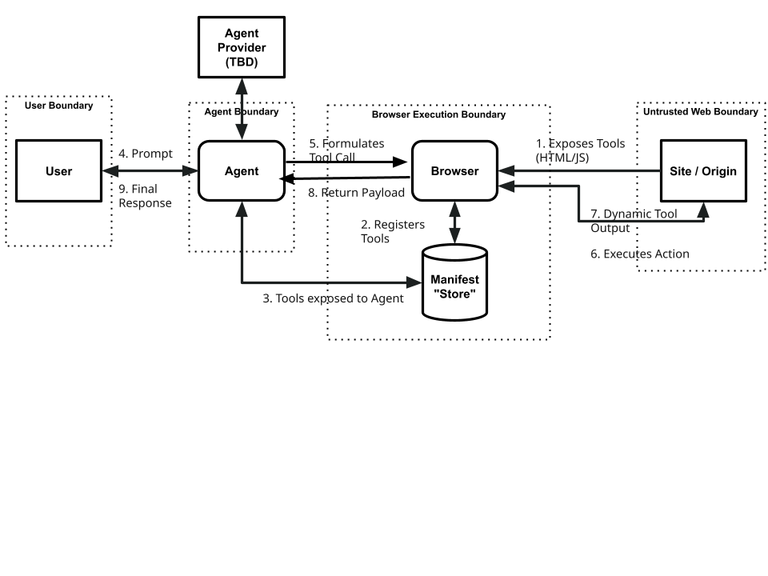
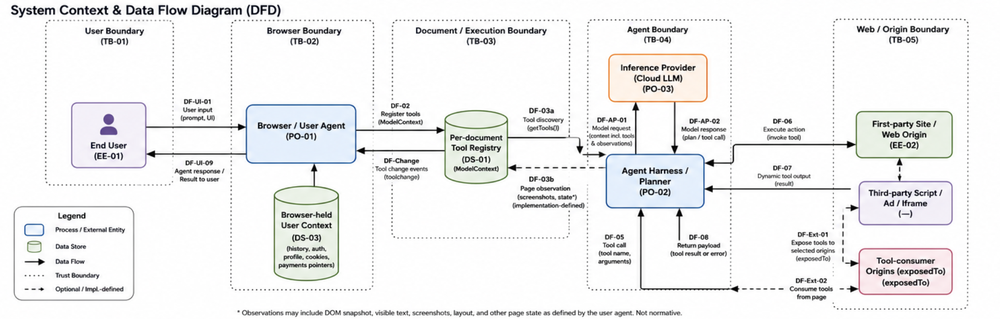

# Review

1. https://webmachinelearning.github.io/webmcp/
2. Security Review Request ([GitHub Issue](https://github.com/webmachinelearning/webmcp/issues/154)
3. [Self-Review Questionnaire](https://github.com/webmachinelearning/webmcp/blob/main/security-privacy-questionnaire.md) filled by the authors

---

# Security & Privacy Review

**Specification:** WebMCP
**Reviewer role:** Security & Privacy
**Guides used:**

- Threat Modeling Guide: [https://w3c.github.io/threat-modeling-guide/](https://w3c.github.io/threat-modeling-guide/)
- Security & Privacy Questionnaire: [https://www.w3.org/TR/security-privacy-questionnaire/](https://www.w3.org/TR/security-privacy-questionnaire/)

---

## Join TM

[Link to shared](https://docs.google.com/document/d/1ZGa9hS3FT_3t0ToD_aJMJ4HA4Uj7diBofU-PCKi4KV0/edit?pli=1&tab=t.0#heading=h.2ab545d0dlp3) threat model

## Stakeholder Inventory

| Stakeholder                               | ID    | Authority / role                                                                                                                                                                                                                                                       | Exposure                                                                                                                                                                                                                                                                               | Blind spot — defensible question                                                                                                                                                                                                                                                                      | Why written this way                                                                                                                                                                                                                                                                                                 |
| ----------------------------------------- | ----- | ---------------------------------------------------------------------------------------------------------------------------------------------------------------------------------------------------------------------------------------------------------------------- | -------------------------------------------------------------------------------------------------------------------------------------------------------------------------------------------------------------------------------------------------------------------------------------- | ----------------------------------------------------------------------------------------------------------------------------------------------------------------------------------------------------------------------------------------------------------------------------------------------------- | -------------------------------------------------------------------------------------------------------------------------------------------------------------------------------------------------------------------------------------------------------------------------------------------------------------------- |
| **End user**                              | EE-01 | Provides goals, prompts and approvals through the browser or agent UI. The threat model assumes an agent may act using the user’s authenticated session and may access browsing history, personalization or payment information. ([Web Machine Learning][1])           | Purchases, transfers, account changes, disclosure of sensitive context and leakage or joining of private-browsing activity. ([Web Machine Learning][1])                                                                                                                                | **Does the user agent clearly display the selected tool, registering origin, arguments, expected side effects, approval state and actual result?** The draft permits tool titles in UI but does not require a complete confirmation or audit interface. ([Web Machine Learning][1])                   | Replace “cannot see” with “is not guaranteed to see.” A browser could expose this information, but WebMCP does not normatively require it.                                                                                                                                                                           |
| **First-party site / document**           | EE-02 | Defines tool names, titles, descriptions, input schemas, annotations and imperative `execute` callbacks. ([Web Machine Learning][1])                                                                                                                                   | Its authenticated state may be changed through a tool; tool-specific execution paths may omit checks present in the normal UI; UGC returned by the site can influence an agent. ([Web Machine Learning][1])                                                                            | **Can the site determine which agent or provider initiated the operation, whether a user requested it and whether the selection resulted from injection?** The imperative callback receives only an input object—not standardized agent identity or user-intent evidence. ([Web Machine Learning][1]) | The site knows its callback ran. The proposed declarative `SubmitEvent.agentInvoked` would identify an agent-triggered submission, but it would not prove agent identity or user authorization, and declarative WebMCP remains normative TODO text. ([GitHub][2])                                                    |
| **Agent harness / planner**               | PO-02 | Interprets user intent, selects tools, generates arguments and routes proposed tool calls. “Harness/planner” is a threat-model component; the draft formally defines an `agent` and a `browser’s agent`, not a separate harness interface. ([Web Machine Learning][1]) | Page-controlled descriptions, parameter descriptions and tool results can steer its reasoning and subsequent actions. ([Web Machine Learning][1])                                                                                                                                      | **Can it verify that a tool’s description and annotations match its real behavior?** It can receive origin provenance, but origin does not establish behavioral integrity or distinguish different scripts within the same origin. ([Web Machine Learning][1])                                        | The original “has no integrity signal” was incorrect. `RegisteredTool` contains `window` and `origin`, and browser-agent implementations are expected to convey origin information; what is missing is behavioral attestation.                                                                                       |
| **Remote inference provider**             | PO-03 | Optional cloud component that may receive prompts, observations, tool definitions or results from the browser-agent implementation. Remote inference and the transmitted format are not prescribed by WebMCP. ([Web Machine Learning][1])                              | May become a recipient of page state, cross-site context and sensitive user information, depending on browser/provider architecture and policy. ([Web Machine Learning][1])                                                                                                            | **Are user text, page text, tool metadata, tool output and their origins preserved as separately labelled data? What is logged or retained?** The draft expects origin information to be conveyed but does not define the provider context format or retention model. ([Web Machine Learning][1])     | “Cannot distinguish user-authored from page-authored text” was too absolute. Providers can source-tag data; whether they do so safely is implementation-dependent.                                                                                                                                                   |
| **Browser / user-agent implementer**      | PO-01 | Provides `Document.modelContext`, maintains the document-associated tool map, enforces secure-context and Permissions Policy checks, and connects page event loops with a browser agent. ([Web Machine Learning][1])                                                   | Bears user-visible consequences of tool execution and must preserve browser security boundaries, including private-browsing separation. Browser storage and cookies are browser-managed; server account state and payment authorization are generally not. ([Web Machine Learning][1]) | **Does it validate arguments, constrain results and mediate sensitive invocations?** The callback accepts an object and returns `Promise<any>`; the IDL contains no output schema or standardized confirmation surface. ([Web Machine Learning][1])                                                   | This is a specification gap or implementation responsibility—not something the browser is technically unable to implement.                                                                                                                                                                                           |
| **Same-origin third-party code provider** | EE-03 | Analytics, tag-manager, CDN, advertising or dependency code executing inside the first party’s origin can access that document’s `ModelContext` and attempt tool registration. ([Web Machine Learning][1])                                                             | A compromised or malicious dependency may register misleading tools, reserve names or return manipulated content using first-party origin authority.                                                                                                                                   | **Which script or dependency registered a tool?** `RegisteredTool` exposes the registering `window` and `origin`, not the responsible script URL, package, author or integrity identity. ([Web Machine Learning][1])                                                                                  | This is an inference from the exposed provenance fields. Same-origin code should not be combined with cross-origin frames because their authority and controls differ.                                                                                                                                               |
| **Delegated cross-origin frame**          | EE-04 | A cross-origin document may use WebMCP only when the `tools` Permissions Policy is delegated. The default allowlist is `'self'`; disallowed registration or discovery rejects with `NotAllowedError`. ([Web Machine Learning][1])                                      | Can register tools belonging to its **own origin**, and may receive specifically exposed tool metadata when both the origin-exposure and Permissions Policy conditions permit it. ([Web Machine Learning][1])                                                                          | **Does the browser show the user that a frame was delegated WebMCP access and identify that frame’s origin?** No normative user-facing delegation inventory or consent UI is specified.                                                                                                               | It does **not** inherit the top-level origin’s cookies or ambient authority merely because `allow="tools"` is present. This row must be separate from same-origin scripts.                                                                                                                                           |
| **Tool-consumer origin / in-page agent**  | EE-05 | A document in the current tree can call `getTools()` for same-origin tools and requested origins, subject to `exposedTo`, `fromOrigins` and Permissions Policy filtering. ([Web Machine Learning][1])                                                                  | Receives names, titles, descriptions, serialized input schemas, annotations, registering windows and origins for tools exposed to it. ([Web Machine Learning][1])                                                                                                                      | **What execution authority does discovery confer, and how can the user inspect or revoke it?** The current IDL defines `registerTool()`, `getTools()` and `toolchange`, but no JavaScript tool-invocation method. ([Web Machine Learning][1])                                                         | The original claim that these origins “inherit the ambient authority of the exposing page” was incorrect. `exposedTo` controls exposure in the current document tree; it does not transfer cookies or origin identity. The registering page can remove a tool through its `AbortSignal`. ([Web Machine Learning][1]) |

[1]: https://webmachinelearning.github.io/webmcp 'https://webmachinelearning.github.io/webmcp'
[2]: https://raw.githubusercontent.com/webmachinelearning/webmcp/main/declarative-api-explainer.md 'https://raw.githubusercontent.com/webmachinelearning/webmcp/main/declarative-api-explainer.md'

---

## Threats

| Threat ID | Title                                                 | Kind / status                                                                                                                                                                              | STRIDE                 | Mitigation documented in draft                                                                                                                                                                                                                                                                                                                            | Primary owner                                     | Residual risk / practical example                                                                                                                                                                                                                                                    |
| --------- | ----------------------------------------------------- | ------------------------------------------------------------------------------------------------------------------------------------------------------------------------------------------ | ---------------------- | --------------------------------------------------------------------------------------------------------------------------------------------------------------------------------------------------------------------------------------------------------------------------------------------------------------------------------------------------------- | ------------------------------------------------- | ------------------------------------------------------------------------------------------------------------------------------------------------------------------------------------------------------------------------------------------------------------------------------------ |
| **TM-01** | Tool-metadata prompt injection                        | **Retain; merge** “input injection” and “metadata prompt injection”                                                                                                                        | T, S                   | Tool names are restricted to 128 ASCII-compatible characters. The draft proposes further length limits and shared attack-evaluation datasets, but descriptions and parameter descriptions remain natural-language model input. ([Web Machine Learning][1])                                                                                                | Agent provider; spec editors; site                | A search tool describes itself normally, then instructs the agent to include the user’s location or send browsing history elsewhere—the draft contains essentially this example.                                                                                                     |
| **TM-02** | Tool-result or UGC prompt injection                   | **Retain; merge** “output injection,” “tool-result injection” and the first part of “exfiltration by response”                                                                             | T, E, I                | `untrustedContentHint` can identify unsafe output. Suggested handling includes sanitization, spotlighting or suppression, but neither the annotation nor those defenses guarantees correct model behavior. ([Web Machine Learning][1])                                                                                                                    | Site; agent provider                              | A product review or forum post contains instructions telling the agent to purchase an item or invoke another tool. The draft gives both scenarios. ([Web Machine Learning][1])                                                                                                       |
| **TM-03** | Cross-tool injection and data exfiltration            | **Retain** as the downstream harm produced by TM-02                                                                                                                                        | I, E, T                | The untrusted-output hint may reduce the likelihood of following injected instructions. No normative taint tracking, information-flow control or cross-tool authorization mechanism exists. ([Web Machine Learning][1])                                                                                                                                   | Agent provider; browser                           | A forum result instructs the agent to call `share-content`, attaching data learned from email, another website or the user profile. OWASP treats indirect prompt injection plus agency as a path to unauthorized functions and disclosure. ([OWASP Gen AI Security Project][2])      |
| **TM-04** | Tool intent misrepresentation                         | **Retain; draft-recognized**. Includes malicious tools, ambiguous descriptions and harmful stale tools. Incorrect answers alone are a reliability issue unless they produce security harm. | S, T, E                | `readOnlyHint` and origin information provide context, but are only hints. The draft explicitly identifies the absence of implementation verification and behavioral contracts. ([Web Machine Learning][1])                                                                                                                                               | Site; agent provider                              | A tool named `finalizeCart` appears to prepare a cart but actually purchases it—the draft’s concrete example.                                                                                                                                                                        |
| **TM-05** | Unauthorized same-origin tool registration            | **Retain; reframe** “unapproved tools registered with Agent”                                                                                                                               | S, T, E                | Secure context, origin-keyed agent clusters, duplicate-name rejection and the `tools` Permissions Policy provide partial protection. They cannot distinguish the site author from analytics, tag-manager or compromised dependency code running in the same origin. ([Web Machine Learning][1])                                                           | Site security and dependency owners; spec editors | A compromised tag-manager script registers `share-location` or a misleading support tool before the site’s application initializes.                                                                                                                                                  |
| **TM-06** | Tool-registry mutation, churn or name reservation     | **Retain; narrowed** from “manifest tampering”                                                                                                                                             | T, D                   | Duplicate names reject; an `AbortSignal` can unregister a tool; `toolchange` announces mutations. Event ordering is not fully reliable, and first registration can still reserve a desired name. ([Web Machine Learning][1])                                                                                                                              | Browser; spec editors; site                       | A dependency registers `checkout` first, causing the legitimate registration to fail, or repeatedly adds and removes tools to force rediscovery. Silent replacement of an existing tool is **not** possible under the current algorithm.                                             |
| **TM-07** | Weak invocation accountability                        | **Retain; merge** both repudiation entries                                                                                                                                                 | R                      | No standardized invocation receipt, audit log, confirmation record, agent identity or user-intent token is defined.                                                                                                                                                                                                                                       | Browser; agent provider; site; spec editors       | A user disputes a purchase or transfer. The site may prove that its endpoint ran, but not which model selected it, what metadata influenced the choice or what the user approved.                                                                                                    |
| **TM-08** | Privacy leakage through over-parameterization         | **Retain; draft-recognized**                                                                                                                                                               | I, E                   | Shared attack evaluations are proposed as a possible mitigation. There is no normative data-minimization rule, sensitivity classification or per-field consent requirement. ([Web Machine Learning][1])                                                                                                                                                   | Agent provider; site                              | A dress-search tool unnecessarily requests pregnancy status, location, age, skin tone and previous purchases—the draft’s example.                                                                                                                                                    |
| **TM-09** | Disclosure to a remote inference provider             | **Reframe as deployment-specific**. Covers “loads WebMCP and sends it to the Agent.”                                                                                                       | I                      | The draft does not prescribe whether inference is remote, what protocol is used, or provider retention controls. It delegates these responsibilities to browser and agent implementations. ([Web Machine Learning][1])                                                                                                                                    | Agent provider; browser vendor                    | A browser observation containing a screenshot, tool inventory and tool output is uploaded to a cloud model. Retention or training is possible only if that provider’s implementation or policy permits it; it is not inherent to WebMCP.                                             |
| **TM-10** | Private-browsing correlation or retention             | **Retain; draft-recognized**                                                                                                                                                               | I; privacy linkability | The draft assigns responsibility to user agents but defines no normative profile-isolation or retention requirement. ([Web Machine Learning][1])                                                                                                                                                                                                          | Browser; agent provider                           | Activity from a private tab—such as a sensitive search—is joined with the normal browser profile or retained in a cloud-agent conversation.                                                                                                                                          |
| **TM-11** | Cross-origin exposure and provenance confusion        | **Retain; reframe** the claim that another origin automatically receives top-level authority                                                                                               | S, I, E                | Permissions Policy defaults to `'self'`; cross-origin access requires delegation. `exposedTo` accepts trustworthy origins, and in-page consumers receive `origin` and `window` provenance. ([Web Machine Learning][1])                                                                                                                                    | Site; browser; spec editors                       | A page delegates `allow="tools"` to a chatbot iframe. The iframe can expose or consume permitted tools, but its callback remains in its **own origin**; it does not automatically inherit the top-level site’s cookies or authority. Misconfiguration and confusing UI remain risks. |
| **TM-12** | Tool and observation resource exhaustion              | **Retain**                                                                                                                                                                                 | D                      | Tool names are length-limited, and further metadata limits are proposed. There are no current normative caps on tool count, description/schema size, result size, mutation rate or invocation duration. ([Web Machine Learning][1])                                                                                                                       | Browser; agent provider; spec editors             | A page registers thousands of tools with large schemas, repeatedly mutates them, or returns a promise that never resolves, increasing latency and inference cost. This resembles OWASP’s model-denial-of-service category. ([OWASP][3])                                              |
| **TM-13** | Unapproved agent observation or activation            | **Retain as implementation threat; merge** “unapproved AI interaction” and “OOB activation”                                                                                                | E, I                   | Observation timing is implementation-defined and the non-normative example allows observations of any top-level browsing context at any time. No normative transient-activation or approval requirement is stated. Current `ModelContext` exposure is Window-only; service-worker operation is not part of the current draft. ([Web Machine Learning][1]) | Browser; agent provider                           | A browser agent inspects a tab after the user has stopped interacting with the agent. Observation is plausible; autonomous tool invocation remains insufficiently specified.                                                                                                         |
| **TM-14** | Cross-tab action without current visibility           | **Retain as a concrete child of TM-13**                                                                                                                                                    | E, I                   | No current normative foreground-tab, recent-interaction or visible-page requirement is defined. Page observation is implementation-defined. ([Web Machine Learning][1])                                                                                                                                                                                   | Browser; agent provider                           | The user is reading one tab while an agent alters account settings or submits an action in another open but unfocused tab.                                                                                                                                                           |
| **TM-15** | High-value declarative auto-submission                | **Future / under-specified; reframe**                                                                                                                                                      | E, T                   | Normative declarative WebMCP is entirely TODO. The explainer requires explicit `toolautosubmit`; without it, the submit control is focused for manual review. ([Web Machine Learning][1])                                                                                                                                                                 | Spec editors; site; browser                       | An explicitly auto-submit-enabled form books a non-refundable flight or modifies an account. The threat is valid for the proposal, but ordinary forms are **not automatically agent tools**, and forms without `toolautosubmit` are not supposed to auto-submit.                     |
| **TM-16** | Agent executes excessive functionality or permissions | **Retain; extracted from several vague “elevated privilege” entries**                                                                                                                      | E                      | The draft recognizes authenticated-session authority and provides only a non-enforceable `readOnlyHint`. It contains no normative least-privilege capability or high-risk-action approval mechanism. ([Web Machine Learning][1])                                                                                                                          | Site; agent provider; browser                     | A support tool can both read and delete tickets, or an account tool can update settings when only lookup was required. OWASP identifies excessive functionality, permissions and autonomy as the root causes of excessive agency. ([OWASP Gen AI Security Project][4])               |

[1]: https://webmachinelearning.github.io/webmcp 'WebMCP'
[2]: https://genai.owasp.org/llmrisk/llm01-prompt-injection/ 'LLM01:2025 Prompt Injection - OWASP Gen AI Security Project'
[3]: https://owasp.org/www-project-top-10-for-large-language-model-applications/ 'OWASP Top 10 for Large Language Model Applications | OWASP Foundation'
[4]: https://genai.owasp.org/llmrisk/llm06-sensitive-information-disclosure/ 'LLM06:2025 Excessive Agency - OWASP Gen AI Security Project'
